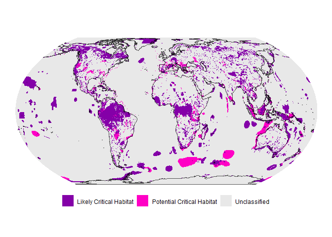

# An update to the global Critical Habitat screening layer

The current version of the layer uses 22 biodiversity feature datasets
that are split into 54 separate triggers.

The latest data leads to 67.67 million km2 of the Earth’s
surface being classified as Likely or Potential Critical Habitat: 53.91
million km2 (10.57%) as Likely Critical Habitat and 13.76
million km2 (2.70%) as Potential Critical Habitat. The
remaining 442.4 million km2 (86.73%) is “Unclassified” as
either known biodiversity features do not align with the IFC definition
or because appropriate data that might be used to classify do not exist:
Critical Habitat may still occur in these regions.

This repository contains code for compiling the latest global Critical
Habitat screening layer, based on the International Finance
Corporation’s Performance Standard 6’s updated Guidance Note of 2019, as
well as code used to produce the associated publication:

> Dunnett, S., Muge, A., Ross, A., Turner, J.A., Burgess, N.D., Jones,
> M., Brooks, S. An update to the global Critical Habitat screening
> layer. *Sci Data* **12**, 1812 (2025).
> <https://doi.org/10.1038/s41597-025-06117-y>

Please see the full paper for detailed methodology.

Archived code at point of submission to *Scientific Data* that can be
used to reproduce the analysis at that point in time can be found on
Zenodo:

The most up-to-date data layers can be found on the [UN Environment
Programme World Conservation Monitoring Centre data
portal](https://data-gis.unep-wcmc.org/portal/home/). Code presented
here and the basic data layer are made available under [CC
BY](https://creativecommons.org/licenses/by/4.0/) but note that the
drill down data layer is made available under a [CC
BY-NC](https://creativecommons.org/licenses/by-nc/4.0/) licence.
