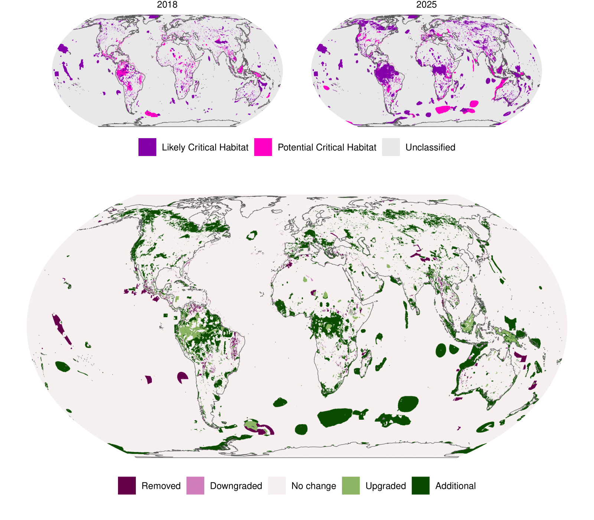

# An update to the global Critical Habitat screening layer

 This repository contains code for compiling the latest
global Critical Habitat screening layer, based on the International
Finance Corporation’s Performance Standard 6’s updated Guidance Note of
2019, as well as code used to produce the associated publication in
*Scientific Data* (accepted in principle).

Please see the full paper for detailed methodology.

Archived code at point of submission to *Scientific Data* that can be
used to reproduce the analysis can be found on Zenodo:

The most up-to-date data layers can be found on the [UN Environment
Programme World Conservation Monitoring Centre data
portal](https://data-gis.unep-wcmc.org/portal/home/). Code presented
here and the basic data layer are made available under [CC
BY](https://creativecommons.org/licenses/by/4.0/) but note that the
drill down data layer is made available under a [CC
BY-NC](https://creativecommons.org/licenses/by-nc/4.0/) licence.
